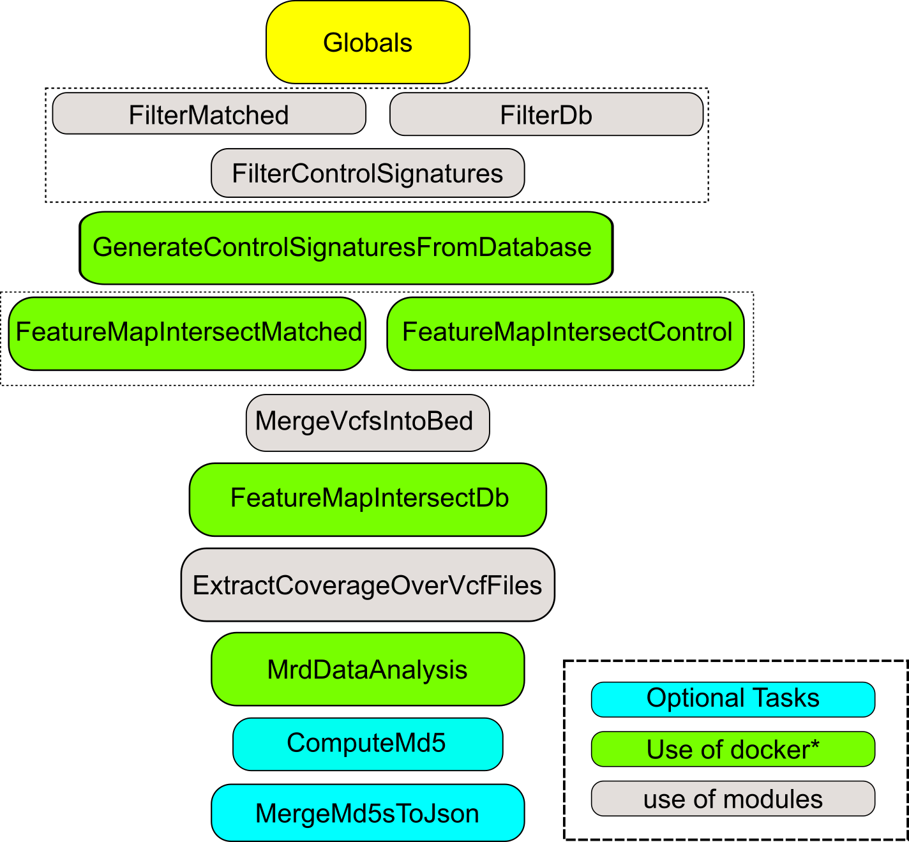
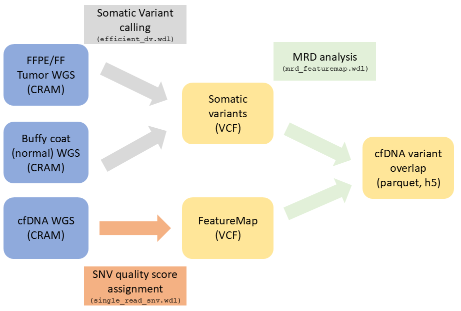

# mrd_featuremap

Ultima Genomics mrd_featuremap fork

This repository contains modified code of Ultima Genomics mrd_featuremap workflow ([https://github.com/Ultimagen/healthomics-workflows/tree/main/workflows/mrd_featuremap](mrd_featuremap)). This workflow runs on Ultima NGS data and is capable of producing Minimal residual disease (MRD) report using outputs from efficient_dv and single_read_snv workflows.
Please treat this repository as a work in progress project as not all of it's elements have been thoroughly tested in production environment.

### Structure of the workflow

The diagram below outlines the connections between tasks and resource modules with outputs listed in a table, also see below

Schematic view of the pipeline showing connection between all three workflows

### Outputs

Output|Type|Description
---|---|---
`features_dataframe`|File|Parquet file of the FeatureMap dataframe after intersection with the matched and control signatures
`signatures_dataframe`|File|Parquet file of the matched and control signatures dataframe
`report_html`|File|Main report showing the results from MRD analysis 
`ctdna_vaf_h5`|File|HDF5 file of the ctDNA VAF and other results of the MRD analysis
`intersected_featuremaps_parquet`|Array[File]|Parquet file of the intersected FeatureMap
`intersected_featuremaps`|Array[File]|VCF file of the intersected FeatureMap
`intersected_featuremaps_indices`|Array[File]|index file of the intersected FeatureMap
`control_signatures_vcf`|Array[File]?|VCF file of the filtered control signatures
`matched_signatures_vcf`|Array[File]?|VCF file of the filtered matched signature 
`db_signatures_vcf`|Array[File]?|VCF file of the filtered db control signatures
`coverage_bed`|File|Coverage stats BED file
`coverage_bed_index`|File|Index of the coverage stats BED file
`md5_checksums_json`|File?|Optional file with md5 checksums for the outputs

### Setting up to run in production environment

MRD featuremap uses multiple resources which may be downloaded from Ultima Genomics website(s) and Amazon buckets. A simple bash script is included, although in the nearest future we may switch to using mrd_featuremap resources wrapped in modules (with Modulator).
